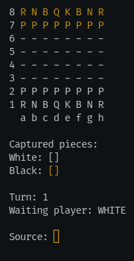

  

<h2 align="center">Java Terminal Chess</h2>
  

    A simple java application implementing a chess into your terminal with a simple UI and all the chess rules and moves. 
     
     
    <a href="https://br.linkedin.com/in/matheus-alvarenga-de-oliveira">My LinkedIn Profile</a>
    ·
    <a href="https://github.com/matheusAlvarenga">My Github Profile</a>

